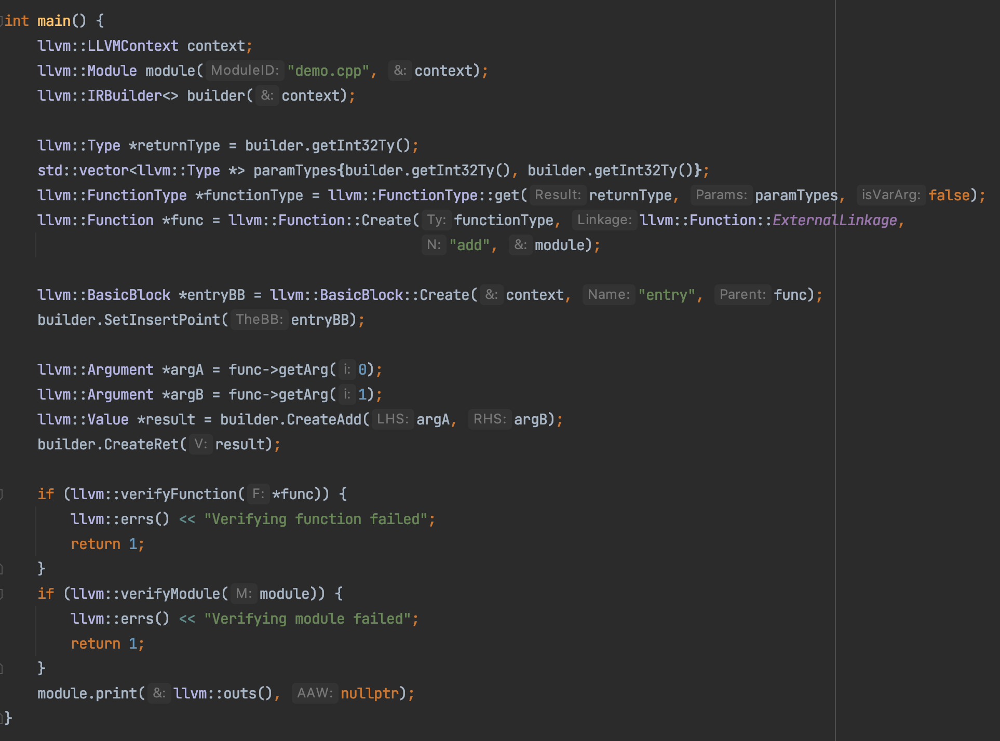
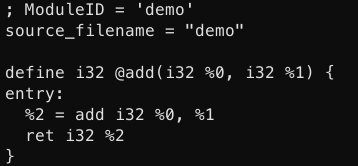

## 序言

众所周知，编译原理、操作系统、图形学被称为程序员的三大浪漫，相信每个程序员都有一个开发一款编译器的梦想。

在2021年的今天，开发一款编译器不再使用一个很难的事情，你只需要:
- 定义你的语法规则
- 进行语法词法分析将源代码按照语法规则解析为语法树
- 做语义分析做一些检查

然后，也是最重要的事情就是**把语法树转换为LLVM IR**, 最后通过LLVM把LLVM IR转为二进制机器码或者WebAssembly等目标格式。

可以看出，LLVM很重要，可以说，`会用LLVM` = `会开发编译器`。

<!--truncate-->

但是......, LLVM使用C++编写的, 不是所有人都喜欢写恶心的C++. 下面这些C++代码你想看吗？不想看吧？



但年轻人的第一款编译器是绕不过LLVM，所以能不能通过JavaScript或者TypeScript去使用LLVM呢？

当然可以，使用[`llvm-bindings`](https://github.com/ApsarasX/llvm-binding)就可以!

作为在2013年获得ACM系统软件奖的开源项目，LLVM肯定是有其他语言的适配器的, 官方就提供了 `Go`/`Ocaml`/`Python` 三种其他语言的适配器。

LLVM有没有提供JavaScript的适配器呢?

很遗憾，LLVM官方并没有提供JavaScript的适配器。

但是LLVM已经诞生了接近二十年了，这么多年中，陆陆续续有些好心人做了一些LLVM的JavaScript的适配器，这些适配器大多都是FFI(跨语言调用), 也有一两个Node.js的C++插件, 但是它们都年久失修了......大多数都停留在了五六年前，和今天2021年最新的LLVM 13基本不兼容。

所以，我开发了[llvm-bindings](https://github.com/ApsarasX/llvm-bindings), 让年轻人们可以通过JavaScript/TypeScript去使用LLVM开发自己的编译器!


话不多说，来试试Demo。

## 安装

[llvm-bindings](https://github.com/ApsarasX/llvm-bindings) 毕竟是LLVM的适配器，不是独立的软件，所以用它之前，你得先把LLVM装好😊。

在macOS上

```shell
brew install cmake llvm
```

在Ubuntu上

```shell
sudo apt-get install cmake
sudo bash -c "$(wget -O - https://apt.llvm.org/llvm.sh)"
```

LLVM比较大，大概1个G，所以安装需要些时间(大概10分钟)，请耐心等待, 建议同学们装之前最好挂一个代理，以免网速太慢而抓狂。

从上面的命令可以看到，我还装了一个cmake，这些必须的，因为cmake是 `llvm-bindings` 的构建器，相当于Webpack。

然后就可以通过npm安装 `llvm-bindings` 了。

```shell
npm install llvm-bindings
```

安装时你会发现会卡一分钟，这是正常的，因为 `llvm-bindings` 需要一分钟的时间去编译。

## 使用

好了，做完准备工作之后，我们就可以开始写我们的mini mini compiler了，创建一个叫做 `llvm-demo.js` 的文件，接下来所有的代码都在这个文件里面写。

首先，第一部分，引入 `llvm-bindings` 并命名为 `llvm`, 没啥好说的。
```js
const llvm = require('llvm-bindings');
```

第二部分，新建context, module, builder
```js
const context = new llvm.LLVMContext();
const module_ = new llvm.Module('demo', context);
const builder = new llvm.IRBuilder(context);
```
> Node.js里全局变量名不能叫module, 所以我把它改成了module_

这里解释一下context, module, builder是什么, 以你家盖房子举例子:

- module: 你家的地基, 房子要盖在地基上，地基上有房子
- builder: 盖房子的工人, 从builder这个名字也可以看出来，是干活的
- context: 学名叫做上下文, 不太好解释；假如你家同时盖两处房子，两处地基不同，工人也不同，但是这两处房子都是你家的，都是你家出钱，可能房子A还需要从房子B借调材料和人力，需要你爸你妈去协调，这么一个环境，叫做context

第三部分，我们要新建一个LLVM的函数

```js
// 函数的返回类型是32位整型
const returnType = builder.getInt32Ty();
// 函数有两个32位整型参数
const paramTypes = [builder.getInt32Ty(), builder.getInt32Ty()];
// 返回类型和参数类型组合起来就是函数的类型(跟TypeScript里面的函数类型一样)
const functionType = llvm.FunctionType.get(returnType, paramTypes, false);
// 创建一个函数, 需要传入函数的类型, 函数可见性, 函数名字符串, 还有module
const func = llvm.Function.Create(functionType, llvm.Function.LinkageTypes.ExternalLinkage, 'add', module_);
```

第四部分，要在函数内添加基本块和指令, 至于基本块、指令和函数是什么关系，这里不做具体解释，可以参考我的知乎文章：https://zhuanlan.zhihu.com/p/102250532

```js
// 入口基本块(本函数比较简单, 只有这个一个基本块)
const entryBB = llvm.BasicBlock.Create(context, 'entry', func);
// 设置插入点
builder.SetInsertPoint(entryBB);
// 获取函数参数1
const a = func.getArg(0);
// 获取函数参数2
const b = func.getArg(1);
// 把参数1和参数2相加
const result = builder.CreateAdd(a, b);
// 把相加结果返回
builder.CreateRet(result);
```

第五部分，也是最后一部分，校验我们所构建的函数和module是否正确，如果正确，则以文本形式打印module所承载的LLVM IR。

```js
if (llvm.verifyFunction(func)) {
    console.error('Verifying function failed');
    return;
}
if (llvm.verifyModule(module_)) {
    console.error('Verifying module failed');
    return;
}
module_.print();
```

好，代码终于写完了，现在我们开始运行代码，执行 `node llvm-demo.js` , 你就会看到



这就是一个简单的add函数的LLVM IR表示，看起来很像汇编对不对，在正常的编译器流程里，LLVM会继续把他转为各种各样的图(DAG之类), 最后进行寄存器分配生成汇编，生成机器码。

## 底层原理

没有什么原理，`llvm-bindings` 就是利用Node.js的C++插件技术在JavaScript与C++之间进行中转。

## 总结

其实这是一个广告贴哈哈，宣传一下我做的 [llvm-bindings](https://github.com/ApsarasX/llvm-bindings) 项目，这是我在做TypeScript程序分析项目的时的一个副产物。不过如今，主项目黄了，这个副产物我倒觉得做的很不错，所以发出来给大家分享一下。

LLVM这个项目，说实话真的很大，仅核心部分(不算clang/lld/lldb等其他库)就有163w行代码，所以目前`llvm-bindings` 并不能覆盖100%的API，如果你想用一些还没有的API，尽情发issue吧，我会在收到issue一天内完成添加。

## FAQ

- Q: llvm-bindings支持哪些版本的LLVM
- A: 最新版支持LLVM 13, `llvm-bindings` 仓库中[有一个地方写了llvm-bindings与LLVM的版本对应关系](https://github.com/ApsarasX/llvm-bindings#compatibility)，看那个就好。

## 相关链接

- LLVM: https://llvm.org
- llvm-bindings: https://github.com/ApsarasX/llvm-bindings
