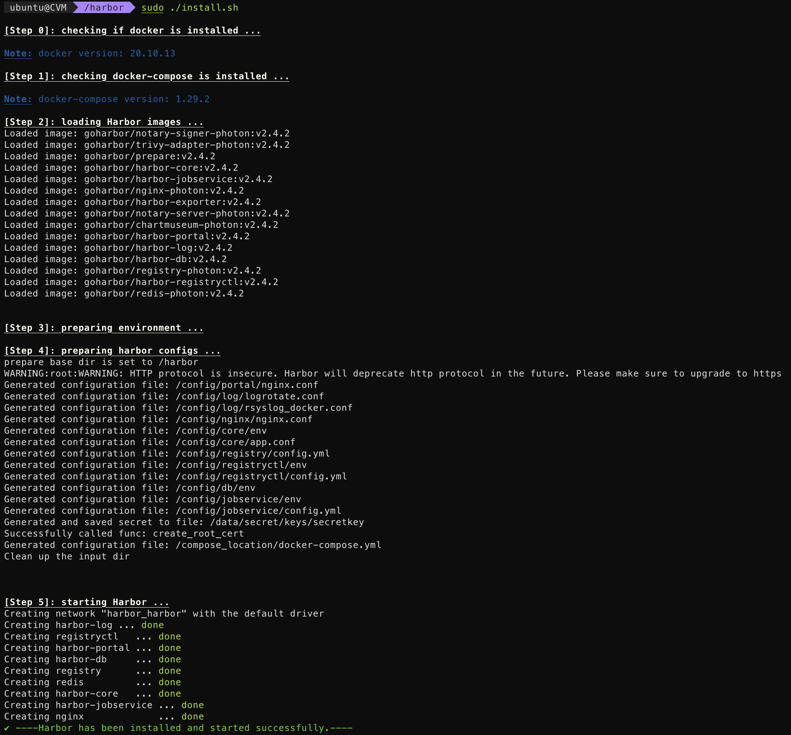
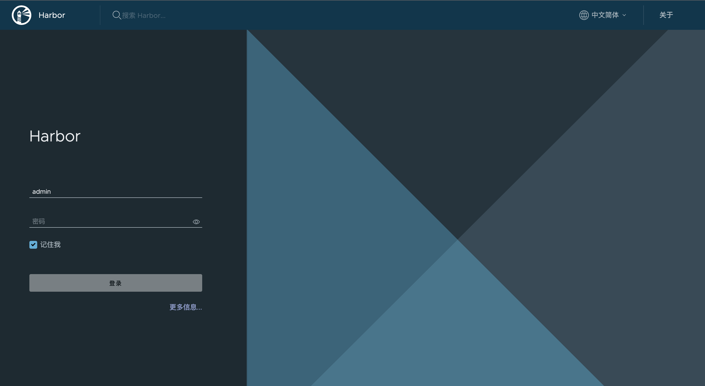

本文将介绍如何使用Harbor搭建私有的Docker镜像服务(HTTP版)，分为服务端操作和客户端操作两部分，服务端操作包括安装Docker和Harbor，客户端操作主要是配置Docker命令的HTTP访问。

下文操作所使用的相关系统及软件环境如下表所示：

| 环境 | 版本 |
| ----- | ----- |
| 操作系统 | Ubuntu 20.04 LTS |
| 服务端IP | 192.168.0.2 |
| Docker | 20.10.13 |
| Docker-Compose | 1.29.2 |
| Harbor | 2.4.2|
<!--truncate-->

:::caution
每个服务端系统环境不同，或许你在执行下文所述的命令时会遇到权限问题，请在命令前加上 `sudo` 再次执行命令。
:::

## 服务端操作

### 安装Docker

在安装Harbor之前，首先需要在服务端系统上把Harbor所依赖的Docker和Docker-Compose装上，安装命令如下所示：

```shell
# 检查更新
sudo apt update
# 安装依赖
sudo apt install ca-certificates curl gnupg lsb-release
# 安装GPG证书
curl -fsSL https://mirrors.aliyun.com/docker-ce/linux/ubuntu/gpg | sudo gpg --dearmor -o /usr/share/keyrings/docker-archive-keyring.gpg
# 写入软件源信息
echo "deb [arch=$(dpkg --print-architecture) signed-by=/usr/share/keyrings/docker-archive-keyring.gpg] https://mirrors.aliyun.com/docker-ce/linux/ubuntu $(lsb_release -cs) stable" | sudo tee /etc/apt/sources.list.d/docker.list > /dev/null
sudo apt update
# 安装Docker
sudo apt install docker-ce docker-ce-cli containerd.io
# 安装Docker-Compose
sudo pip3 install -i https://mirrors.aliyun.com/pypi/simple docker-compose
```

可以使用下面的命令来判断是否安装成功，正常情况下会输出所安装Docker的版本。

```shell
docker -v
```

### 下载Harbor

去Harbor官方仓库的Release页面下载离线安装包并解压。

```shell
# 离线下载安装包
wget https://github.com/goharbor/harbor/releases/download/v2.4.2/harbor-offline-installer-v2.4.2.tgz
# 解压
tar xvf harbor-offline-installer-v2.4.2.tgz
```

### 修改Harbor配置文件

进入所解压出来的 `harbor` 目录，将 `harbor.yml.tmpl` 复制为 `harbor.yml`。

```shell
# 复制配置文件
cd harbor
cp harbor.yml.tmpl harbor.yml
```

然后对 `harbor.yml` 做如下所示的修改。

```diff title="harbor.yml"
# Configuration file of Harbor

# The IP address or hostname to access admin UI and registry service.
# DO NOT use localhost or 127.0.0.1, because Harbor needs to be accessed by external clients.
- hostname: reg.mydomain.com
+ hostname: reg.mydomain.com

# http related config
http:
  # port for http, default is 80. If https enabled, this port will redirect to https port
  port: 80

# https related config
- https:
-   # https port for harbor, default is 443
-   port: 443
-   # The path of cert and key files for nginx
-   certificate: /your/certificate/path
-   private_key: /your/private/key/path
+ # https:
+ #   # https port for harbor, default is 443
+ #   port: 443
+ #   # The path of cert and key files for nginx
+ #   certificate: /your/certificate/path
+ #   private_key: /your/private/key/path

# # Uncomment following will enable tls communication between all harbor components
# internal_tls:
#   # set enabled to true means internal tls is enabled
#   enabled: true
#   # put your cert and key files on dir
#   dir: /etc/harbor/tls/internal

# Uncomment external_url if you want to enable external proxy
# And when it enabled the hostname will no longer used
# external_url: https://reg.mydomain.com:8433

# The initial password of Harbor admin
# It only works in first time to install harbor
# Remember Change the admin password from UI after launching Harbor.
- harbor_admin_password: Harbor12345
+ harbor_admin_password: 请替换为管理员密码

# Harbor DB configuration
database:
  # The password for the root user of Harbor DB. Change this before any production use.
-   password: root123
+   password: 请替换为Harbor数据库密码
  # The maximum number of connections in the idle connection pool. If it <=0, no idle connections are retained.
  max_idle_conns: 100
  # The maximum number of open connections to the database. If it <= 0, then there is no limit on the number of open connections.
  # Note: the default number of connections is 1024 for postgres of harbor.
  max_open_conns: 900

# The default data volume
- data_volume: /data
+ data_volume: 请替换为Harbor数据存储目录
```

### 安装Harbor

执行下面的命令开始正式安装Harbor：

```shell
# 准备工作(备份已有的证书并删除旧版本的镜像)
./prepare
# 安装
./install.sh
```

如果没有问题，控制台会有像这样的输出：



也可以访问Harbor管理网页来判断是否安装成功，如果Harbor安装成功，在浏览器中访问 `http://192.168.0.2` 会看到如下所示的界面：



用户名默认为 `admin`，密码是在 `harbor.yml` 中所配置的 `harbor_admin_password` 字段。

## 客户端操作

### 配置Docker

如果不做任何配置直接在客户端中使用 `docker pull` 拉取或者使用 `docker push` 推送镜像，会出现如下错误：

```
Error response from daemon: Get "https://192.168.0.2/v2/": dial tcp 101.43.218.206:443: connect: connection refused
```

这是因为本文所搭建的镜像服务是HTTP版的，而客户端上的Docker默认使用HTTPS访问远程镜像仓库，如果要正常使用，必须在客户端Docker的 `/etc/docker/daemon.json` 配置文件中配置 `insecure-registries` 字段，该字段为Harbor镜像服务所在的服务端IP地址。

```json title="/etc/docker/daemon.json"
{
    "insecure-registries": ["192.168.0.2"]
}
```

然后重启客户端的Docker服务使上述字段生效。

```shell
sudo systemctl restart docker
```

:::caution
如果你需要在搭建Harbor镜像服务的同一台服务端机器上执行拉取或者推送镜像的操作，强烈建议在安装Harbor之前配置 `insecure-registries` 字段并重启Docker，因为重启Docker会导致Harbor的部分容器重启时发生错误。当然，你也可以先安全地关闭Harbor镜像服务，然后再重启Docker。
:::

### 测试实验

首先需要保证客户端中存在至少一个docker镜像，这里先从默认的镜像服务中拉取一个 `alpine` 镜像。

```shell
docker pull alpine
```

如果要把这个 `alpine` 镜像推送到上面搭建的Harbor镜像服务，还需要给它设置一个特定格式的别名，这个格式是 `your.domain.com/PROJECT_NAME/REPOSITORY[:TAG]`，别名设置过程如下所示：

```shell
docker tag alpine 192.168.0.2/library/demo
```

登录本文搭建的镜像服务。

```shell
docker login 192.168.0.2
```

> 需要输入账户名和密码(同管理网页的账户名和密码)

推送 `alpine` 镜像到服务端。

```shell
docker push 192.168.0.2/library/demo
```

将 `alpine` 镜像从Harbor镜像服务中拉取下来。

```shell
docker pull 192.168.0.2/library/demo
```

:::tip
在使用Harbor镜像服务时，客户端所执行的命令需要遵循以下格式：

```shell
docker tag SOURCE_IMAGE[:TAG] your.domain.com/PROJECT_NAME/REPOSITORY[:TAG]
docker push your.domain.com/PROJECT_NAME/REPOSITORY[:TAG]
docker pull your.domain.com/PROJECT_NAME/REPOSITORY[:TAG]
```

其中 `PROJECT_NAME` 是在 Harbor UI 新建的项目名，`REPOSITORY` 是镜像名，`TAG` 是镜像标签。

:::