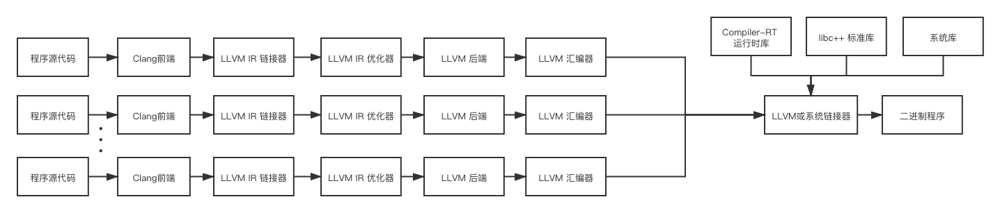
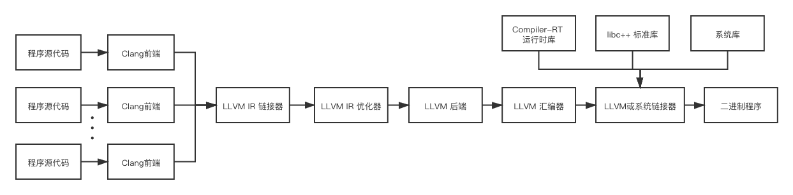

## LLVM IR
传统的静态编译器分为三个阶段：前端、中端（优化）、后端。

而大名鼎鼎的gcc编译器在设计的时候没有做好层次划分，导致很多数据在前端和后端耦合在了一起，所以gcc支持一种新的编程语言或新的目标架构特别困难。

有了gcc的前车之鉴，LLVM进行了如下图所示的三阶段设计


这样支持一种新的编程语言只需重新实现一个前端，支持一种新的目标架构只需重新实现一个后端，前端和后端连接枢纽就是LLVM IR。

LLVM IR本质上一种语言和机器无关的通用中间表示，是LLVM项目的核心设计和最大的优势。

LLVM IR使用静态单赋值（SSA）策略，具有以下两个特征：
- 以三地址码形式组织指令

- 假设有无数的寄存器可用

假设已经写好一个名为`main.c`的C程序代码，使用以下命令可以得到其LLVM IR
```shell
# 二进制代码形式
clang -emit-llvm -c main.c -o main.bc

# 可读文本代码形式
clang -emit-llvm –S -c main.c -o main.ll
```

> 除了上面两种形式之外，LLVM IR还有一种形式是在内存中的编译中间语言

下图是一段add函数对应的LLVM IR示例


> LLVM IR之于LLVM相当于 Java ByteCode之于Java

## LLVM的含义
在不同的语义环境下，LLVM具有以下几种不同的含义：

- LLVM基础架构：即一个完整编译器项目的集合，包括但不限于前端、后端、优化器、汇编器、链接器、libc++标准库、compiler-rt和JIT引擎

- 基于LLVM构建的编译器：部分或完全使用LLVM构建的编译器

- LLVM库：LLVM基础架构可重用代码部分

- LLVM核心：在LLVM IR上进行的优化和后端算法

- LLVM IR：LLVM中间表示

## LLVM基础架构的组成部分
- 前端：将程序源代码转换为LLVM IR的编译器步骤，包括词法分析器、语法分析器、语义分析器、LLVM IR生成器。Clang执行了所有与前端相关的步骤，并提供了一个插件接口和一个单独的静态分析工具来进行更深入的分析

- 中间表示：LLVM IR可以以可读文本代码和二进制代码两种形式呈现。LLVM库中提供了对IR进行构造、组装和拆卸的接口。LLVM优化器也在IR上进行操作，并在IR上进行了大部分优化。

- 后端：负责汇编码或机器码生成的步骤，将LLVM IR转换为特定机器架构的汇编代码或而二进制代码，包括寄存器分配、循环转换、窥视孔优化器、特定机器架构的优化和转换等步骤

下面这张图展示了使用LLVM基础架构时各个组件之间的关系



除此之外，各个组件之间的协作关系也可以以下面这种方式组织



> 两种方式的主要区别是程序源代码内部的链接是由LLVM或系统链接器完成的还是由LLVM IR链接器完成的，前者是默认方式，后者一般在开启链接优化（Link-Time Optimization）时采用


## LLVM中间数据结构
在LLVM中并不只存在LLVM IR一种中间表现形式，LLVM在不同编译阶段采用以下不同的中间数据结构：

- LLVM IR：见文章开头

- 抽象语法树（AST）：将源代码转换为LLVM IR时，Clang前端语法分析器和语义分析器的产出数据结构

- 有向无环图（DAG）：将LLVM IR转换为特定机器架构的汇编代码时，LLVM首先将其转换为有向无环图（DAG）的形式，以方便进行指令选择，然后将其转换回三地址码的形式以进行指令调度

- MCModule类：为了实现汇编器和链接器，LLVM使用MCModule类将程序表示保存在对象文件（可重定向文件的一种，通常文件名以.o结尾）的上下文中

不同编译阶段的中间数据结构有以下两种存在方式：

- 内存中：需要编译驱动程序的帮助，将一个阶段的输出数据结构作为下一个阶段的输入数据结构

- 文件中：独立命令之间多数以文件为媒介进行交互，比如汇编器与链接器通过可重定向的`.o`对象文件进行交互

