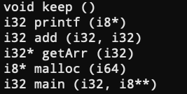

# LLVM概述—第一个LLVM项目

这篇文章，我们将编写我们的第一个具有Hello World意义的LLVM项目。

在这个项目中，我们会利用LLVM库来寻找并打印一段C语言程序中的所有函数签名。

## 函数签名

C语言中的函数签名由以下几部分组成：
- 函数名
- 参数个数及参数类型
- 返回类型

比如
```c
int add(int a, int b) {
    return a + b;
}
```
这段C程序代码中的add函数的函数签名就是 `int add(int, int)`

## 待处理的C程序代码

```c
#include <stdio.h>
#include <stdlib.h>

void keep() {
    printf("\n");
}

int add(int a, int b) {
    return a + b;
}

int* getArr(int n) {
    return (int*)malloc(sizeof(int) * n);
}

int main(int argc, char** argv) {
    return 0;
}
```

项目运行结果是



我们在这段代码中定义了包括main函数在内的四个函数，但是最终结果却是六个函数，这是因为我们调用了C标准库中的printf函数和malloc函数，编译器在预处理阶段将这两个函数的声明加入到了代码中。

另外一个值得关注之处是，与C语言中 `int`、`char` 等类型不同，打印出来的函数签名中的类型是 `i32`、`i8`，这其实是因为我们首先需要把待处理的C程序代码转换为LLVM IR的二进制类型，然后才会用我们自己写的LLVM项目对其进行处理，打印出来的类型其实是LLVM IR的类型，除此之外，`long` 对应 `i64`、`float` 对应 `f32`、`double` 对应 `f64`，不过LLVM IR `void` 和指针两种类型还是与C语言相同的。

## 项目代码

```cpp
// 引入相关LLVM头文件
#include <llvm/IR/LLVMContext.h>
#include <llvm/IR/Function.h>
#include <llvm/IR/Module.h>
#include <llvm/IRReader/IRReader.h>
#include <llvm/Support/SourceMgr.h>
#include <llvm/Support/CommandLine.h>

using namespace llvm;

// LLVM上下文全局变量
static ManagedStatic<LLVMContext> GlobalContext;

// 命令行位置参数全局变量, 这个参数的含义是需要处理的LLVM IR字节码的文件名
static cl::opt<std::string> InputFilename(cl::Positional, cl::desc("<filename>.bc"), cl::Required);

int main(int argc, char **argv) {
    // 诊断实例
    SMDiagnostic Err;
    // 格式化命令行参数,
    cl::ParseCommandLineOptions(argc, argv);
    // 读取并格式化LLVM IR字节码文件, 返回LLVM Module(Module是LLVM IR的顶级容器)
    std::unique_ptr<Module> M = parseIRFile(InputFilename, Err, *GlobalContext);
    // 错误处理
    if (!M) {
        Err.print(argv[0], errs());
        return 1;
    }
    // 遍历Module中的每一个Function
    for (Function &F:*M) {
        // 过滤掉那些以llvm.开头的无关函数
        if (!F.isIntrinsic()) {
            // 打印函数返回类型
            outs() << *(F.getReturnType());
            // 打印函数名
            outs() << ' ' << F.getName() << '(';
            // 遍历函数的每一个参数
            for (Function::arg_iterator it = F.arg_begin(), ie = F.arg_end(); it != ie; it++) {
                // 打印参数类型
                outs() << *(it->getType());
                if (it != ie - 1) {
                    outs() << ", ";
                }
            }
            outs() << ")\n";
        }
    }
}
```

## 项目编译运行

在编译项目之前，我们需要确认一下编译运行环境
- 操作系统：Ubuntu 20.04 64位
- LLVM版本：13.0.1
- 待处理的C程序代码文件：`test.c`
- 项目代码文件：`main.cpp`

然后获取待处理的C程序代码的LLVM IR字节码

```shell
clang-13 -emit-llvm -c test.c -o test.bc
```

再编译

```shell
clang++-13 $(llvm-config-13 --cxxflags --ldflags --libs) main.cpp -o main
```

最后运行得到上文图示的结果

```shell
./main test.bc
```
