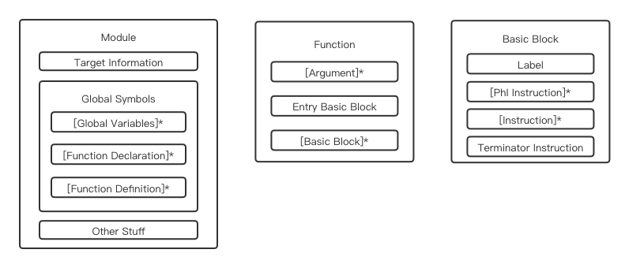

# LLVM IR概述
在前面的文章中我们已经对LLVM IR做了简单的介绍，本文将简单地介绍LLVM IR（具体指令部分将留到后面的文章）
## 获取LLVM IR
LLVM IR有三种形式，分别是内存中的编译中间表示、磁盘上的二进制码和可读汇编文本，后两种形式可以通过以下命令获取

```shell
# 二进制码形式
clang -emit-llvm -c main.c -o main.bc

# 可读汇编文本形式
clang -emit-llvm –S -c main.c -o main.ll
```
所得LLVM IR可读汇编文本形式的示例如下图所示

> 分号是注释
> 第7-11行是main函数
> 第14-23行是add函数，第25行是函数属性
> 第27-32行是模块元信息

## LLVM IR结构


我们需要首先理解四个具有依次包含关系的基本概念：
- Module（模块）是一份LLVM IR的顶层容器，对应于编译前端的每个翻译单元（TranslationUnit）。每个模块由目标机器信息、全局符号（全局变量和函数）及元信息组成。

- Function（函数）就是编程语言中的函数，包括函数签名和若干个基本块。每个函数由很多基本块组成，函数内的第一个基本块叫做入口基本块。

- BasicBlock（基本块）是一组只会顺序执行的指令集合，只有一个入口和一个出口，非头尾指令执行时不会违背顺序跳转到其他指令上去。每个基本块最后一条指令一般是跳转指令（跳转到其它基本块上去），函数内最后一个基本块的最后条指令是函数返回指令。

- Instruction（指令）是LLVM IR中的最小可执行单位，每一条指令都单占一行


LLVM IR头部是一些Target Information，在前文图中所示为
```
; ModuleID = 'add.c'
source_filename = "add.c"
target datalayout = "e-m:o-i64:64-f80:128-n8:16:32:64-S128"
target triple = "x86_64-apple-macosx10.14.0"
```
每一行分别是，
- Module ID：编译器用于区分不同模块的ID
- source_filename：源文件名
- target datalayout：目标机器架构数据布局
- target triple：用于描述目标机器信息的一个元组，一般形式是 `<architecture>-<vendor>-<system>[-extra-info]`

需要关注的是 `target datalayout`，它由 `-` 分隔的一列规格组成
- `e`：内存存储模式为小端模式
- `m:o`：目标文件的格式是Mach格式
- `i64:64`：64位整数的对齐方式是64位，即8字节对齐
- `f80:128`：80位扩展精度浮点数的对齐方式是128位，即16字节对齐
- `n8:16:32:64`：整型数据有8位的、16位的、32位的和64位的
- `S128`：128位栈自然对齐

> 更多细节请阅读&nbsp;[LLVM IR Data Layout](https://llvm.org/docs/LangRef.html#data-layout)


## 标识符与变量
LLVM IR中的标识符有两种基本类型：全局标识符（以 `@` 开头）和局部标识符（以 `%` 开头）

> LLVM IR要求标识符以前缀开头有两个原因：
- 无需担心带有保留字的名称冲突，并且将来可以扩展保留字的集合而不会带来任何损失
- 未命名的标识符使编译器可以快速提出一个临时变量，而不必避免符号表冲突。

全局标识符，包括全局变量和函数，比如
```
@globalVar = global i32 20, align 4

define i32 @main() {
    ret i32 0
}
```

> globalVar其实是个指针


局部标识符，即局部变量。LLVM IR中的局部变量有两种分类方案：

按照是否命名分类：
- 命名局部变量：(顾名思义)

- 未命名局部变量：以带前缀的无符号数字值表示，比如 `%1`、`%2`，按顺序编号，函数参数、未命名基本块都会增加计数


按照分配方式分类：
- 寄存器分配的局部变量：此类局部变量多采用 `%1 = some value` 形式进行分配，比如函数返回结果变量和`load`指令返回的局部变量
- 栈分配的局部变量：使用 `alloca` 指令在栈帧上分配的局部变量，比如 `%2 = alloca i32`，`%2` 也是个指针，访问或存储时必须使用 `load` 和 `store` 指令

例如以下一段LLVM IR
```llvm
define i32 @main() {
    %1 = alloca i32, align 4
    %tmp = alloca i32, align 4
    store i32 1, i32* %1, align 4
    store i64 2, i32* %tmp, align 8
    %2 = add nsw i32 %1, %tmp
    %result = add nsw i32 %1, %2
}
```

其中 `%1` 是栈分配的未命名局部变量，`%tmp` 是栈分配的命名局部变量，`%2` 是寄存器分配的未命名局部变量，`%result` 是寄存器分配的命名局部变量


