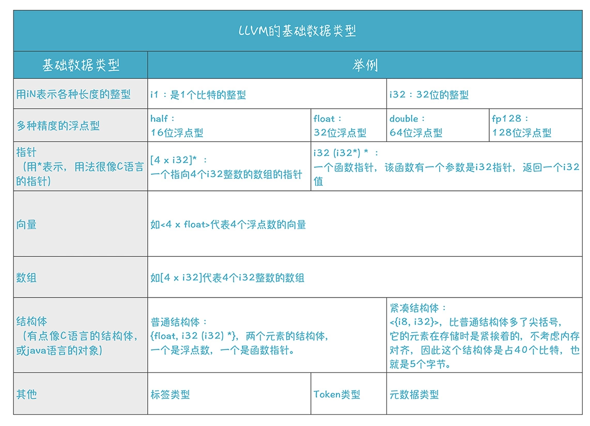

# LLVM IR语法—类型系统

类型系统是LLVM IR最重要的特性之一，强类型有利于在LLVM IR上开启大量优化

## void类型

void类型代表无类型，与C/C++中的 `void` 同义，例如下面这段IR中定义了一个名为 `nop` 的 `void` 函数

```llvm
define void nop() {
    
}
```

## 函数类型
可以将函数类型看做函数签名，它由返回类型和形参类型列表组成，返回类型可以是 `void` 类型或除 `label` 和`metadata` 类型以外的一等类型

格式如下
```llvm
<returntype> (<parameter list>)
```
其中 `<parameter list>` 是逗号分隔的类型列表，其中可能包括 `...` 类型（可变数量参数类型）

以下列举了几种函数类型的示例
```llvm
; 返回类型为i32且只有一个i32参数的函数
i32 (i32)

; 一个返回类型为float且参数类型为i16和i32*的函数指针
float (i16, i32 *) *

; 可变数量参数的函数, 这其实是printf函数的签名
i32 (i8*, ...)

; 返回类型为包含两个i32的结构体，参数类型为一个i32的函数
{i32, i32} (i32)
```

## 一等类型
在LLVM IR中，一等类型的值只能由指令运算得出；一等类型包括
- 单值类型
    - 整数类型
    - 浮点类型
    - `X86_mmx` 类型
    - 指针类型
    - 向量类型
- 标签类型
- 令牌类型
- 元数据类型
- 复杂类型
    - 数组类型
    - 结构类型
    - 不透明结构类型

> 显然，`void` 类型和函数类型就不是一等类型，因为它们不能通过指令运算得出

## 单值类型
这些类型是从CodeGen的角度看来在寄存器中有效的类型

## 整数类型
整数类型是一个非常简单的类型，它简单地为所需的整数类型指定一个任意的数据宽度。可以指定从1到2^23 -1（约8百万）位的任何数据宽度。

语法格式
```llvm
iN
```
其中的 `N` 就是数据宽度，例如
```llvm
; 单位整数类型, 可以表示布尔类型
i1

; 最常见的32位整数类型
i32

; 数据宽度超过100万位的超级大整数类型
i1942652
```

## 浮点数类型

| 类型 | 说明 |
| --- | --- |
| half | 16位浮点数 |
| float | 32位浮点数 |
| double | 64位浮点数 |
| fp128 | 128位浮点数（其中112位尾数） |
| x86_fp80 | 80位浮点数（X87） |
| ppc_fp128 | 128位浮点数（两个64位） |

`half`，`float`，`double` 和 `fp128` 的二进制格式分别对应于IEEE-754-2008标准的binary16，binary32，binary64和binary128。

## x86_mmx类型
x86_mmx类型表示在x86机器上的MMX寄存器中保存的值。允许的操作相当有限：参数和返回值，`load` 指令和 `store` 指令以及 `bitcast` 指令。用户指定的MMX指令表示为具有此类型的参数和结果的内部调用或asm调用。不存在这种类型的数组、向量或常量。

语法格式
```llvm
x86_mmx
```

## 指针类型
指针类型用于指定内存位置。指针通常用于引用内存中的对象。

指针类型可能有一个可选的地址空间属性，该属性定义指向对象所在的编号地址空间。默认地址空间是数字零。非零地址空间的语义是特定于目标的。

请注意，LLVM不允许指向 `void(void*)` 的指针，也不允许指向标签 `(label*)` 的指针，如有相关需要，请使用 `i8*` 代替

语法格式
```llvm
<type> *
```

示例
```llvm
; 4个的i32的数组的指针
[4 x i32]*

; 函数指针，它接受一个i32*类型参数，返回类型是i32
i32 (i32*) *

; i32值的指针，指向驻留在地址空间#5中的值
i32 addrspace(5)*
```

## 向量类型
向量类型是表示元素向量的简单派生类型，用于单个指令并行操作多个基本数据（SIMD）。 向量类型需要指定大小、基础原始数据类型和可伸缩属性，以表示在编译时确切硬件向量长度未知的向量。 

语法格式
```llvm
< <# elements> x <elementtype> >          ; 定长向量
< vscale x <# elements> x <elementtype> > ; 可伸缩向量（弹性向量）
```

向量中的元素数量必须是一个大于0的整型常量，元素的原始类型只能是整型、浮点型和指针型。

对于可伸缩向量，元素的总数量必须是其对应的定长向量元素数量的整数倍（这个倍数称之为vscale）。vscale在编译期未知，在运行期对于所有的可伸缩向量它是一个相同硬件相关常数。虽然可伸缩向量类型的值所占用字节大小直到运行时候才能被检测出来，但在LLVM IR里它的尺寸就是个常量（只是在运行前我们无法得知这个常量罢了）

示例
```llvm
; 4个32位整数值的向量
<4 x i32>

; 8个32位浮点值的向量
<8 x float> 

; 2个64位整数值的向量
<2 x i64>

; 4个64位整数值指针的向量
<4 x i64*>

; 4个32位整数值的倍数的可伸缩向量
<vscale x 4 x i32>
```


## 令牌类型

当值与指令相关联时使用token类型，但该值的所有用法不得试图反思或模糊它。因此，具有phi或select类型令牌是不合适的。

语法格式
```llvm
token
```

## 元数据类型

元数据类型表示嵌入的元数据。除函数参数外，不得从元数据创建派生类型。

语法格式
```llvm
metadata
```

## 聚合类型

聚合类型是派生类型的一个子集，可以包含多个成员类型。数组和结构是聚合类型，而向量不是聚合类型。

## 数组类型

数组类型是一种非常简单的派生类型，它将元素按顺序排列在内存中，需要指定大小（元素数量）和元素类型。

语法格式
```llvm
[<# elements> x <elementtype>]
```
`elements` 是一个常数整数值; `elementtype` 可以是任何尺寸的类型

示例
```llvm
; 包含40个32位整数值的数组
[40 x i32]

; 41个32位整数值的数组
[41 x i32]

; 包含4个8位整数值的数组 
[4 x i8]

; 下面是多维数组

; 3x4的32位整数值数组
[3 x [4 x i32]]

; 12×10的单精度浮点数组
[12 x [10 x float]]

; 2x3x4的16位整数值数组
[2 x [3 x [4 x i16]]]
```

除了静态类型隐含的数组末尾之外，没有对索引的限制（尽管在某些情况下索引超出了分配对象的范围）。这意味着可以在零长度数组类型的LLVM中实现单维“可变大小数组”。例如，在LLVM中实现"pascal样式数组"可以使用类型 `{ i32, [0 x float]}`。

## 结构体类型（Structure Type）

结构体类型用于表示内存中一组数据成员的集合，结构体中的数据成员可以是任何具有大小的类型。

通过 `getelementptr` 指令获取指向结构体中某个字段的指针，然后使用 `load` 和 `store` 指令访问这个指针指向的内存。寄存器中的结构体可使用 `extractvalue` 指令和 `insertvalue` 指令进行访问。

还有一种稠密结构体（packed structure），按单字节对齐（也就是没有进行内存对对齐），在内存中成员字段之间没有空白填充。与之相比，一般的结构体为了按照 `target-datalayout` 进行内存对齐，成员字段之间可能插入了一些空白填充。

结构体既可以是字面量，也可以赋给标识符：
- 字面量结构体以内联的方式进行定义，而标识符结构体始终在LLVM IR顶层使用名称进行定义
- 字面量结构体被其内容唯一标识，既不能是递归的，也不能是抽象的（opaque）；而标识符结构体恰恰相反，既可以是递归的，也可以是抽象的

语法格式
```llvm
%T1 = type { <type list> }     ; 一般结构体类型
%T2 = type <{ <type list> }>   ; 稠密结构体类型
```

示例
```llvm
{ i32, i32, i32 }       ; 包含3个i32类型的结构体

{ float, i32 (i32) * }  ; 成员是float类型和函数指针类型的结构体

<{ i8, i32 }>           ; 5个字节大小的稠密结构体
```

## 抽象结构体类型（Opaque Structure Types）
抽象结构体类型用于表示没有实体的命名结构体类型，比如C语言中的前置结构体声明
> 关于Opaque Pointer, 请查看[https://en.wikipedia.org/wiki/Opaque_pointer](https://en.wikipedia.org/wiki/Opaque_pointer)

语法格式
```llvm
%X = type opaque
%52 = type opaque
```

## 总结
此处插入一张宫文学老师《编译原理之美》中介绍LLVM IR类型系统的归纳图
