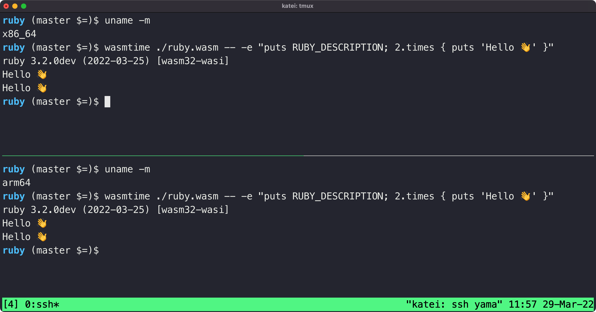

## [Ruby 3.2.0 Preview 1 发布 - 支持WebAssembly](https://www.ruby-lang.org/en/news/2022/04/03/ruby-3-2-0-preview1-released/)

Ruby 是一种解释型高级语言，依赖于垃圾收集器进行内存管理。因此，Ruby 应用程序无法像 Rust、C++ 或 AssemblyScript 那样直接编译为 WebAssembly，而是需要将运行时本身编译为 WebAssembly。

Ruby 3.2.0 Preview 1 版本发布，支持 WebAssembly 和 WASI，这意味着您应该能够在任何支持 WebAssembly 运行时和 WASI 接口的地方运行它。

您可以在 [Ruby 团队成员的博客文章](https://itnext.io/final-report-webassembly-wasi-support-in-ruby-4aface7d90c9)中找到有关如何实现这一点的技术细节。此外，如果您只是想自己尝试一下，[Wasm Builders 有一个不错的小介绍](https://www.wasm.builders/rjzak/ruby-webassembly-bcj)。

## [Javy: JavaScript to WebAssembly 工具链](https://github.com/Shopify/javy)

与 Ruby 类似，JavaScript 也是解释型语言，带有垃圾回收机制，这意味着它不能直接编译为 WebAssembly。 为了运行 JavaScript，您还必须包含一个合适的运行时。 [这篇博文描述了通过 QuickJS 运行 JavaScript](https://www.thetechplatform.com/post/running-javascript-in-webassembly-with-wasmedge)。

这听起来像是一个重量级的解决方案，然而，它却出人意料地可行。 在上周的 QCon 上，来自 Fastly 的 Will Overton 发表了一次演讲，他提到他们正是使用这种技术在他们的边缘网络上运行 JavaScript。 他们还利用 [Wizer](https://github.com/bytecodealliance/wizer) 等工具在执行之前预初始化模块。

Javy 是一个将 QuickJS 和 JavaScript 代码打包为 WebAssembly 模块的工具。[Wasm Builders 上的一篇文章](https://www.wasm.builders/deepanshu1484/javascript-and-wasi-24k8) 简单介绍了 Javy 的使用。

## [Spin](https://www.fermyon.com/blog/introducing-spin)

Fermyon 目前正在提出各种很酷的东西，例如 WAGI（在[第136期](https://wasmweekly.news/issue-136)中出现，一个受 CGI 启发的 WebAssembly 运行时)。这篇博文宣布了 Spin，一个新的微服务框架，将微服务编译为 WebAssembly 模块。

该团队已经将 Spin 在团队内部投入使用，Spin的文档网站就运行在 Spin 和 Bartholomew（该团队开发的基于 WebAssembly 的 CMS）上。

## [使用Rust编写Redux Reducer](https://fiberplane.dev/blog/writing-redux-reducers-in-rust/)

Reducer 是一种操作 Redux 状态的函数，必须有类似 `(previousState, action) => newState` 这样的结构 ，并且没有副作用，这意味着将它们移植到 WebAssembly 中非常容易。虽然可能不是很实用，但如果你正在学习 WebAssembly，这是一个很好的开始。

## [使用WebAssembly、Rust 和 Xor 过滤器在 Next.js 中进行静态全文搜索](https://hackernoon.com/static-full-text-search-in-nextjs-with-webassembly-rust-and-xor-filters-tldr)

这篇博文着眼于如何使用 WebAssembly 添加客户端全文搜索功能。
