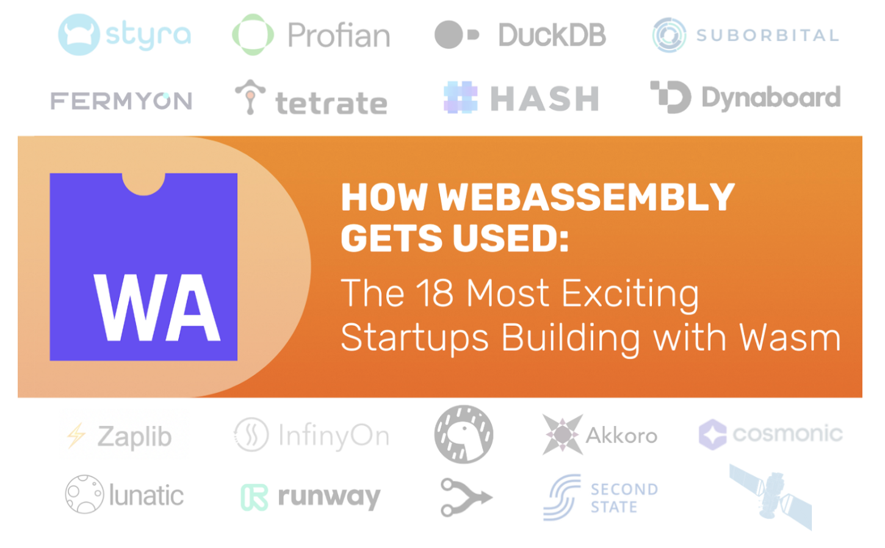

## [WebAssembly 2.0 首份公开草案](https://www.w3.org/TR/wasm-core-2/)

第一份 WebAssembly 规范草案是由 W3C 发布的，该组织也负责管理 HTML 和 CSS 等其它规范。WebAssembly v1.0 旨在成为 MVP（最小可行产品），提供将一些具有挑战性的工作负载转移到浏览器的能力，例如 Google Earth 和 Unreal 游戏引擎。

从那时起，许多新的功能已经被添加到规范中，在最近发布的 v2.0 工作草案中达到了顶峰。请前往 [Hacker News](https://news.ycombinator.com/item?id=31088412) 查看 v2.0 中添加的新功能。

## [18个使用 WebAssembly 的初创公司 ](https://reneeshah.medium.com/how-webassembly-gets-used-the-18-most-exciting-startups-building-with-wasm-939474e951db)

WebAssembly 运行时正被越来越多的公司使用，包括大型科技公司（Google、BBC、Adobe）和初创公司，这篇博文列出了将 WebAssembly 作为商业模式核心的一些初创公司。

这些公司的 CEO 和 CTO 有很多精彩的发言，准确地解释了他们为什么选择 WebAssembly。

## [构建 WebAssembly 驱动的 Serverless 平台](https://blog.scottlogic.com/2022/04/16/wasm-faas.html)

WebAssembly 正在成为非常流行的运行时，所以我想自己动手创建一个简单的 Serverless 平台。

在这篇博文中，我探讨了 Wasmtime 这个 WebAssembly 运行时，并在短短70行代码中建立了一个 WebAssembly 驱动的Serverless 平台，发现将 WebAssembly 融入产品真的很容易。

## [基于JavaScript 弱引用的 WebAssembly 垃圾回收](https://jott.live/markdown/js_gc_in_wasm)

参考上面的W3C WebAssembly v2.0规范，WebAssembly 还没有加入垃圾收集的功能。这篇博文演了如何通过 JavaScript 胶水代码来实现垃圾回收的功能，核心原理是使用 JavaScript 运行时的弱引用。

## [无限 Mac：浏览器中即时启动的 Quadra](https://blog.persistent.info/2022/03/blog-post.html)

最后，在您的浏览器中玩一些有趣的东西，一个功能齐全的 68k Mac。功能几乎齐全，不过当尝试[国际象棋](https://en.wikipedia.org/wiki/Battle_Chess)时它崩溃了😂。