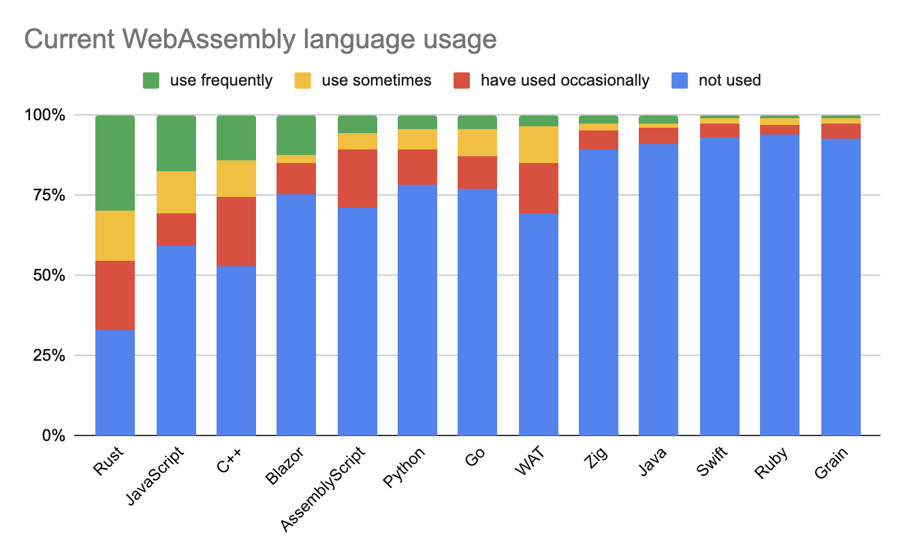

## [2022年 WebAssembly 现状调查结果公布](https://blog.scottlogic.com/2022/06/20/state-of-wasm-2022.html)

关注此次调查的读者们会看到，今年调查结果与去年相比有了明显的变化。

在当前 Serverless 和容器化的大环境下，WebAssembly 成为了 Docker 潜在的竞争对手，越来越多的文章在关注 WebAssembly。当然，我本人也希望看到这种变化，但变化的程度如此之快，让我感到非常意外，总结来说，此次调查结果非常值得一看。

这里有一些关于此次调查结果的要点提纲：

- Rust 的使用率和需求持续攀升
- Python 的使用量有了很大的提升
- JavaScript 已经成为一种可行的 WebAssembly 语言
- 对 Blazor 来说，今年是个好年头，使用率和需求都有很大提升
- Wasmtime 是使用最广泛的 WebAssembly 运行时
- WebAssembly 在 Serverless、容器化和插件等方面的使用已显着攀升
- 开发者们更频繁地使用 WebAssembly
- 非浏览器 API 是 WebAssembly 最需要的

## [WebAssembly 组件和 wasmCloud Actors](https://wasmcloud.com/blog/webassembly_components_and_wasmcloud_actors_a_glimpse_of_the_future/)

已经有一些提案试图改善 WebAssembly 的集成体验，其中[组件模型](https://github.com/WebAssembly/component-model)是最新的一个，目前该提案处于第 1 阶段（提案生命周期的早期），但已经获得了非常多的关注。

**组件模型**的目标是您能够将任意 Wasm 模块粘合在一起，这些模块可以导入或导出函数，由接口文件指定。或者换句话说，它应该允许以任何语言编写的模块的无缝集成。这篇文章通过一些实际的例子来演示提案的具体使用方法。

您可能还对来自 Shopify 的 Saúl Cabrera 的演讲感兴趣，该演讲讲解了**组件模型**并提出了一个问题：[Are We Polyglot Yet?](https://www.youtube.com/watch?v=A5xOMlZTWs8)

## [Notes on WebAssembly](http://neugierig.org/software/blog/2022/06/wasm-notes.html)

这篇对 WebAssembly 简明扼要的介绍文章在 Hacker News 的首页上享有盛誉，我相信我的大多数读者都会知道这些东西，希望大家能够与朋友们分享这篇文章。

## [.NET Core 和 WASI 的未来可能性](https://www.youtube.com/watch?v=A0vz_BWxIMc)

您肯定听说过 Blazor，但您可能不知道 .NET 团队正在探索 WebAssembly 在服务器端的可用性。在 Steve Sanderson 的这次演讲中有一些很棒的演示，包括一个[完全在浏览器中运行的 ASP.NET Core 服务器](https://stevesandersonms.github.io/aspnetcore-in-browser/)。需要明确的是，这是一个很酷的演示，但史蒂夫警告不应该在生产环境中这样做！
