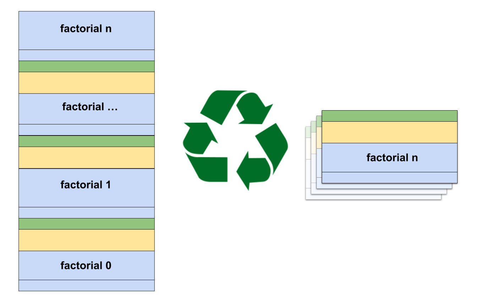

## [尾调用的实现原理](https://leaningtech.com/fantastic-tail-calls-and-how-to-implement-them/)

自从2015年MVP发布以来，WebAssembly 一直在持续发展，不断接受并跟踪各种[功能提案](https://github.com/WebAssembly/proposals)，其中很多提案涉及一些相对底层的功能，对Web开发人员来说并不是很好理解。

LeaningTech 多年来一直致力于普及 WebAssembly 相关的技术。在这篇文章中，LeaningTech 深入浅出地介绍了尾调用的实现原理，以及尾调用对 WebAssembly 的意义。

## [Cloudflare Workers 宣布支持 WASI](https://blog.cloudflare.com/announcing-wasi-on-workers/)

WebAssembly 系统接口 (WASI) 提供了一套 API，允许 WebAssembly 模块与外部服务交互，例如访问文件系统和网络。Cloudflare 在这篇博文中宣布了对 WASI 的支持，并附带一些很好的插图示例。

## [WebAssembly Everywhere](https://byrnemluke.com/posts/webassembly)

这是一本非常优秀的 WbeAssembly 入门文章，介绍了 WebAssembly 是什么，以及 WebAssembly 的优势（简单的运行时、可移植性、安全性）。该文章也讨论了 WebAssembly 相关的各种用例，其中许多是非浏览器的，其中一个有趣的部分介绍了使用 WebAssembly 的公司和项目及其背后的考量。该文章还在最后介绍了 WebAssembly 未来可能的发展。

这篇文章也关注了一些 WebAssembly 的竞争技术，并探讨了一些 WebAssembly 的场景和功能，非常值得一读。

## [Zig](https://zigmonthly.org/letters/2022/may-june/)

Zig 是一种新型的系统编程语言，发布仅仅6年，比 C++ 要年轻得多，C++ 已经存在了 37 年，但C++可能仍然是最广泛使用的系统编程语言！

Zig 对 WebAssembly 有很好的支持，所以很高兴看到 Zig 正在变得具有生产价值。

## [Ballerina 的 WebAssembly 后端](https://poorna.info/posts/wasm-backend/)

[Ballerina](https://github.com/ballerina-platform/ballerina-lang) 是一种专门为编写分布式应用程序而设计的开源编程语言，这篇博文介绍了一个将 WebAssembly 后端添加到 Ballerina 的项目，即允许您将 Ballerina 应用程序编译到 WebAssembly。

## [fizzy - Wasm 解释器](https://github.com/wasmx/fizzy)

使用 C++ 编写的 Fizzy 项目旨在成为一个高性能、确定性的和保守的 WebAssembly 解释器。

## [Cargo component](https://github.com/bytecodealliance/cargo-component)

[WebAssembly 组件模型](https://github.com/WebAssembly/component-model)是一个正在进行中的提案，其目标是更容易地将用不同语言编写的多个 WebAssembly 模块组合到一个应用程序中。目前，我们所做的很多事情都受到我们使用的语言的限制。如果您是 C# 开发者，并且需要做一些数据科学工作，为什么不能直接在代码中使用丰富的 Python 数据科学生态系统？

这个 `Cargo component` 项目帮助您了解 WebAssembly 组件模型，尽管该项目和 WebAssembly 组件模型规格书都尚未完成。